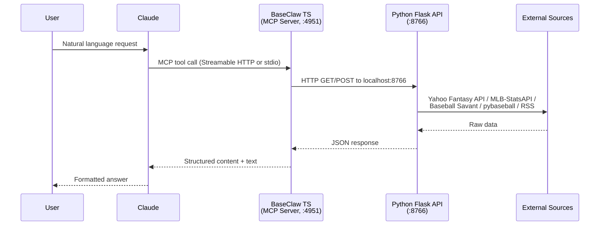

# BaseClaw Architecture

## Why TypeScript + Python?

BaseClaw is a dual-language system that plays to each ecosystem's strengths:

- **TypeScript** has the strongest MCP SDK support and the only production OAuth 2.1 implementation (`@modelcontextprotocol/sdk`). It handles tool registration, structured responses, MCP Apps (inline HTML UIs), and remote authentication.
- **Python** has the best baseball data libraries: `yahoo_fantasy_api` for league operations, `pybaseball` for Statcast/FanGraphs data, `MLB-StatsAPI` for live MLB data, and `pandas`/`numpy` for the z-score valuation engine.

The two runtimes run inside a single Docker container. The entrypoint starts the Python Flask API in the background and the Node MCP server in the foreground:

```sh
python3 /app/scripts/api-server.py &
exec node /app/mcp-apps/dist/main.js
```

## Data Flow



## Container Architecture

```
docker-compose.yml
  baseclaw (single container)
    :4951  -> Node MCP server (foreground)
    :8766  -> Python Flask API (background)
    /app/config  -> Yahoo OAuth credentials, auth state
    /app/data    -> Rankings JSON, projection CSVs
    /app/scripts -> Python modules
```

Key environment variables:

| Variable | Purpose |
|---|---|
| `YAHOO_CONSUMER_KEY/SECRET` | Yahoo API credentials (auto-generates `yahoo_oauth.json` on first boot) |
| `PYTHON_API_URL` | Internal API address (default `http://localhost:8766`) |
| `MCP_SERVER_URL` | Public URL for remote OAuth (e.g., `https://yahoo-fantasy.jwein.me`) |
| `MCP_AUTH_PASSWORD` | Password for the OAuth 2.1 login page |
| `ENABLE_WRITE_OPS` | Gate for roster-mutating tools (default `false`) |

## Tool Organization

The TS layer registers tools across 11 files in `mcp-apps/src/tools/`:

| File | Prefix | Domain |
|---|---|---|
| `roster-tools.ts` | `yahoo_` | Roster, add/drop, browser status |
| `standings-tools.ts` | `yahoo_` | Standings, matchups, schedules |
| `season-tools.ts` | `yahoo_` | Lineup, trades, waiver wire |
| `valuations-tools.ts` | `yahoo_` | Z-score lookups, trade evaluator |
| `history-tools.ts` | `yahoo_` | Historical league data |
| `mlb-tools.ts` | `mlb_` | Teams, rosters, schedules, scores |
| `intel-tools.ts` | `fantasy_` | Statcast, FanGraphs, splits, WAR |
| `strategy-tools.ts` | `fantasy_` | Category analysis, weekly strategy |
| `prospect-tools.ts` | `fantasy_` | Prospect rankings, call-up odds |
| `workflow-tools.ts` | `yahoo_` | Auto-lineup, multi-step workflows |
| `meta-tools.ts` | — | Tool discovery, health checks |

Toolset profiles (`MCP_TOOLSET` env var) control which tools load. The `default` profile loads ~26 tools; `all` registers everything.

## Caching Strategy

All caching is in-memory with TTL-based expiration. The Python layer uses a shared `cache_get(dict, key, ttl)` helper and a `CacheManager` class for structured cache operations with hit/miss tracking.

| Source | TTL | Rationale |
|---|---|---|
| Baseball Savant / Statcast | 6 hours | Updated overnight; intraday queries are identical |
| FanGraphs (leaderboards, WAR) | 6 hours | Same as Savant |
| Splits data | 24 hours | Stable within a season |
| Prospect rankings | 24 hours | Change weekly at most |
| MLB-StatsAPI (rosters, scores) | 30 minutes | Lineup changes, live scores |
| Prospect roster status | 30 minutes | Tracks call-ups/options |
| Yahoo API connections | 30 seconds | Token refresh boundary |
| League settings | 1 hour | Rarely change mid-season |
| News/RSS feeds | 15 minutes | Breaking news freshness |
| Analysis/editorial feeds | 30 minutes | Less time-sensitive |
| News context per player | 5 minutes | Short-lived aggregation |
| Prospect buzz | 15 minutes | Social chatter velocity |
| Valuations (loaded projections) | 5 minutes | Recompute on projection updates |
| SGP calculations | 1 hour | Standings-dependent, stable intraday |

Cache stats and manual clearing are exposed via `/api/cache-stats` and `/api/cache-clear`.

## Z-Score Valuation Methodology

The valuation engine (`scripts/valuations.py`) uses the **FVARz method** (FanGraphs Value Above Replacement z-score) adapted for this league's 20 categories.

### Counting stats (R, H, HR, RBI, K, TB, XBH, NSB, IP, W, L, ER, HLD, QS, NSV)

Standard z-score: `z = (x - mean) / std`. Stats where lower is better (K for hitters, L, ER) are inverted (`z * -1`).

### Ratio stats (AVG, OBP, ERA, WHIP)

Three-step volume-weighted z-score:

1. **Raw z-score** against the unweighted pool mean/std
2. **Volume weighting** — multiply raw z by plate appearances (hitters) or innings pitched (pitchers)
3. **Re-normalize** the volume-weighted values across the player pool

This prevents a .400 AVG in 50 PA from outranking a .310 AVG in 600 PA. The volume weighting is the key insight from FanGraphs' FVARz approach.

### Final value

Per-category z-scores are summed into `z_total`. Minimum PA/IP thresholds filter out small samples. Park factor adjustments are applied before z-score computation. Players are tiered by z-score cutoffs for draft/trade reference.

### Projection sources

The engine loads projections from multiple systems (when available) and can compare across them to surface disagreements — players where one system is significantly more bullish than consensus.

## Security Model

### Layer 1: MCP OAuth 2.1 (remote access)

For remote connections (Claude.ai via Pangolin reverse proxy), the TS server implements the full MCP OAuth 2.1 spec:

- `YahooFantasyOAuthProvider` manages the authorization flow with PKCE
- Password-based login page (password from `MCP_AUTH_PASSWORD`)
- Access tokens (7-day TTL), refresh tokens (30-day TTL), master tokens (1-year TTL)
- Auth state persisted to `/app/config/auth-state.json`
- Token cleanup runs hourly

For local use (Claude Code via `.mcp.json`), the server runs over stdio — no auth needed.

### Layer 2: Yahoo OAuth (API access)

All Yahoo Fantasy API calls go through `yahoo_fantasy_api` which uses OAuth 1.0a:

- Credentials stored in `/app/config/yahoo_oauth.json`
- Auto-generated from env vars on first boot if the file doesn't exist
- Token refresh is handled by the `yahoo-oauth` library

### Layer 3: Write operation gating

Roster mutations are gated at two levels:

1. **`ENABLE_WRITE_OPS` env var** (default `false`) — when false, write tools (add, drop, trade, set lineup) are not registered at all. They do not appear in the tool list.
2. **Browser session** — write operations that touch the Yahoo web UI (everything except auto-lineup) require an authenticated Playwright browser session (`yahoo_browser.py`). A background heartbeat refreshes the session every 6 hours to keep cookies alive. `yahoo_browser_status` exposes session health.

This two-layer approach means a misconfigured client cannot accidentally make roster moves: the tools literally do not exist unless the operator explicitly enables them.
